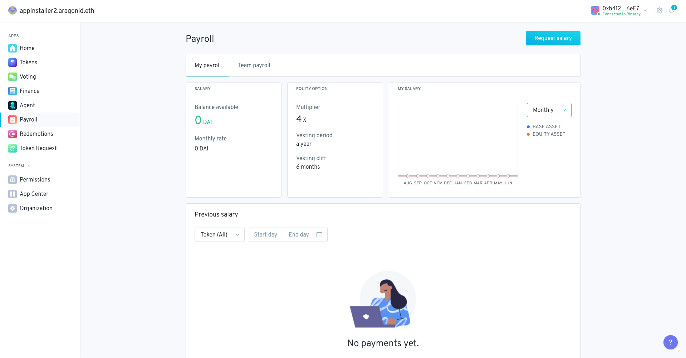

# Payroll 

Fork of the [Aragon's Payroll App](https://github.com/1Hive/payroll-app)

The purpose of the Payroll app is to implement a Payroll system for employees in base asset, equity asset or a mix of both.

Employees can request payroll whenever they want and the proportional amount of their anual salary since the last request (or since the start date if it's the first one) will be transferred.
Employees can choose to receive payment in base asset (denomination token), equity asset, or a mix of both. `_denominationTokenAllocation` determines the % of base asset payment from the total owed and the remaining will be paid in equity asset. The equity token payment is relative to the base asset payment and is defined by the equity multiplier. E.g If an employee has a salary of 1000 DAI and the multiplier is 4x then they can mint up to 4000 of the equity asset per period.

#### 🚨 Security Review Status: audited

The code in this repository [has been audited.](https://github.com/ConsenSys/aragon-payroll-audit-report-2019-06)
